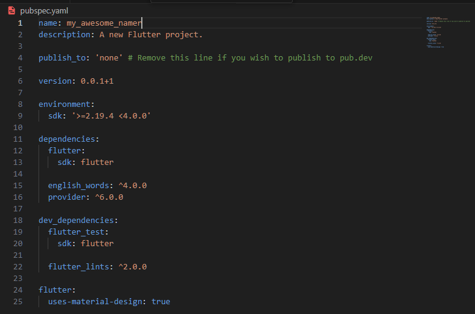

# first-flutter-app-codelab
My first flutter app for Mobile Programming assignment

Nama: Josafat Pratama Susilo

NIM : 2141720031

Kelas : TI-3F


## Daftar Isi

- [Create a project](#create-a-project)
- [Add a button](#add-a-button)
- [Make the app prettier](#make-the-app-prettier)
- [Add functionality](#add-functionality)
- [Add navigation rail](#add-navigation-rail)
- [Add a new page](#add-a-new-page)

## Create a project

Setelah berhasil membuat sebuah project flutter, maka langkah selanjutnya adalah mengedit pubspec.yaml. File ini berfungsi untuk memberikan informasi dasar mengenai project yang kita buat seperti versi aplikasi tersebut, dependencies yang digunakan, beserta asset-assetnya.



Kemudian konfigurasi analysis_options.yaml untuk mengatur bagaimana Flutter menganalisis kode yang ditulis.


Kemudian mengubah isi main.dart, sehingga output dari aplikasi menjadi seperti berikut


## Add a button

First Hot Reload. 
Ketika diubah, dan di save maka fitur hot reload akan jalan dengan output berubah menjadi seperti berikut:


Kemudian menambahkan button seperti berikut.


Setelah itu menerapkan sebuah behavior supaya ketika button ditekan, maka kata random akan berubah seperti berikut.


## Make the app prettier

Langkah pertama yang dilakukan adalah melakukan ekstraksi widget. Cara yang dilakukan adalah refactor widget, sebuah fitur helper untuk melakukan ektraksi. Dengan mengubah kode main.dart menjadi seperti berikut akan membuat ```Text``` widget tidak lagi terreferensi dengan appState.


Setelah melakukan ekstraksi dan wrapping dengan padding pada Text widget, maka akan menghasilkan output seperti berikut.


Kemudian wrap text tadi dengan card supaya menjadi seperti berikut.


## Add functionality

## Add navigation rail

## Add a new page